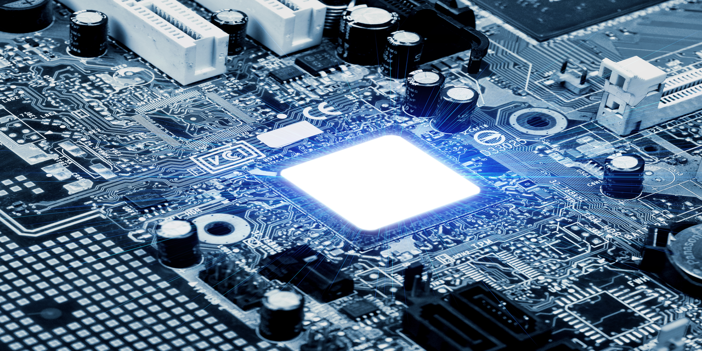

 
 

### Hi I'm Vignesh Raj👋

 

   
   
   
   
   

Welcome to my profile! I'm a recent Master Graduate at Kaunas University of Technology. I'm from India, living in Lithuania, and am currently looking for entry-level jobs related to electronics. Thanks for visiting and I'd love to [connect](https://www.linkedin.com/in/rajmvr/) !

**Field of interest**: PCB Design, Embedded system, 5G.

### Skills 🛠️
- **Languages**: &nbsp;&nbsp; &nbsp;                           C, C++, Matlab, Python
- **IDE**: &nbsp;&nbsp; &nbsp; &nbsp; &nbsp; &nbsp; &nbsp; &nbsp; &nbsp;                      Code Blocks, VS Code, Keil uVision, IAR
- **PCB Design**:  &nbsp;&nbsp;  Altium, Solidworks PCB, Proteus
- **Others**:  &nbsp;&nbsp;&nbsp;&nbsp;&nbsp;&nbsp;&nbsp;&nbsp;&nbsp;             Git, Github, front-end Website Design

### Education 🎓

<!--
- [Master’s degree](https://github.com/dayyass/prior-knowledge-layer-for-sequence-tagging) @ Lomonosov Moscow State University (2019 - 2023)
- [Bachelor's degree](https://github.com/dayyass/bachelor-diploma) @ Plekhanov Russian University of Economics (2015 - 2019)
-->
- [Master’s degree]- Masters in Electronics Engineering  @Kaunas University of Technology (2019 - 2022)
- [Bachelor's degree]- Electronics and Communication Engineering  @DMI College of Engineering (2015 - 2019)
- [Higher Secondary Course]- @St. Mary's Matriculation Higher Secondary school (2014 - 2015)
- [Secondary School Course]- @St. Mary's Matriculation Higher Secondary school (2012 - 2013)
### Thesis 🚀
- Investigation of 5G Radio wave propagation in macro cell environments -[Click here](https://github.com/Rajmvr24/Masters-Thesis)
- Implementation of IOT in Agriculture (AGRIBOT 1.0)

### Extra courses 📜
- PCB Design using Altium Designer @skillshare -[Click here](https://github.com/Rajmvr24/PCB-Design-using-Altium-Designer)

<!--
### Achievements/Certification 🏆
- dfbdbdgb
- jhgug
-->
### Currently Learning 🌱 

- Real time operating system
- Multilayer PCB design

### Academic Works 🖋
- Research and development the device for product tracking using STM(X-Nucleo-NFC04A1) -[Click here](https://github.com/Rajmvr24/Product-tracking-using-RFID)
- Other works uploading soon...🗒

### Other DIY fun Works
- Front-end Website Design
- Motion Picture Design
- Creating a Github profile portfolio

### Fun facts about me 😃
- I'm on track with learning more about PCB design and Embedded Systems✍️
- In my free time, I enjoy playing pc games🎮.
- I am a science guy and love space 🔭
- Planning to custom build my gaming pc setup 🖥️
- Like to play chess ♟️
- Currently working on building my profile to get opportunities👨‍💼

 

Thanks for checking my full Profile 👍
 

If you like my profile in github feel free to give a star 🌟
